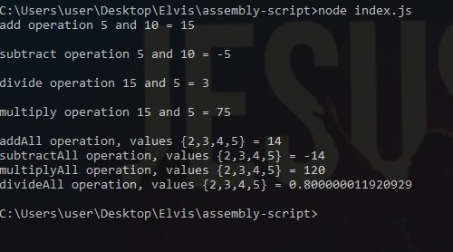

## Simple Arithmetic in Assembly - (AssemblyScript)
----------
So basically thats a taste for AssemblyScript
 
I wrote 8 AssemblyScript functions 
4 of them just perform an operation on 2 values
4 of them just perform an operation on an array

And these are the results  



##### How to use

In the build folder, we have an `optimized.wasm` file which can be imported to any JS runtime like using their [@assemblyscript/loader](https://www.npmjs.com/package/@assemblyscript/loader) which they claim:
> [It]...makes working with AssemblyScript modules as convenient as it gets without sacrificing efficiency.

NodeJS
```
const fs = require("fs");
const loader = require("@assemblyscript/loader");
const imports = { /* imports go here */ };
const wasmModule = loader.instantiateSync(fs.readFileSync(__dirname + "/build/optimized.wasm"), imports);
```


Now to use in your application  
`console.log(wasmModule.exports.yourFunc(...args))`

Simple? yep


##### My take?
Ermm, idk, but I think it needs to mature a bit. I cant really see any convenient use cases yet. I'll try some algorithms on it later and see how that goes in terms of syntax and ease of use.

I will take C++ over this any day and use emscripten (not tried it but I have read possiblities) to compile/transpile to WASM.

----------
###### Next Tests (In another repo)
1. Bubble sort Algorithm
2. Binary Tree Algorithm

